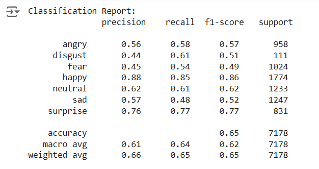
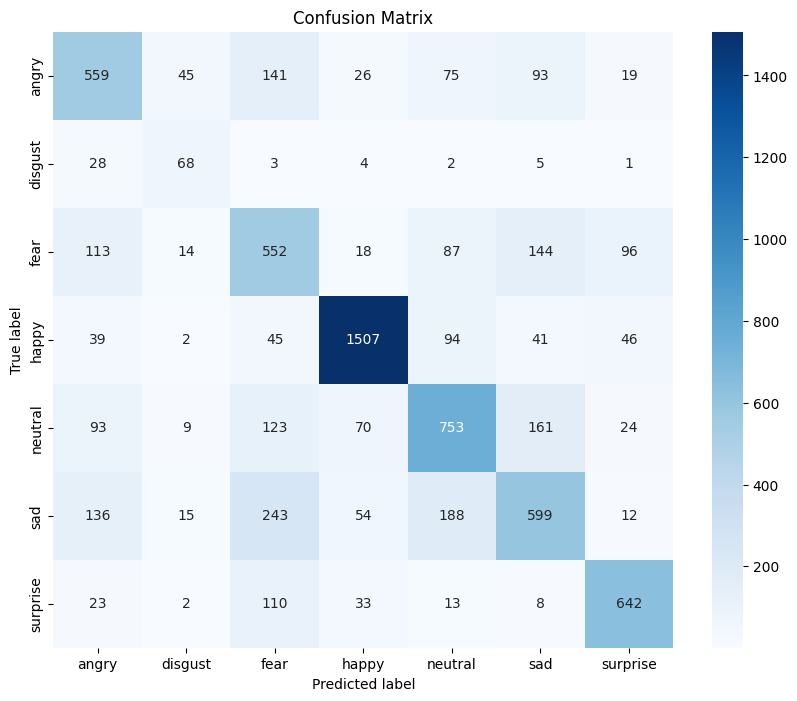
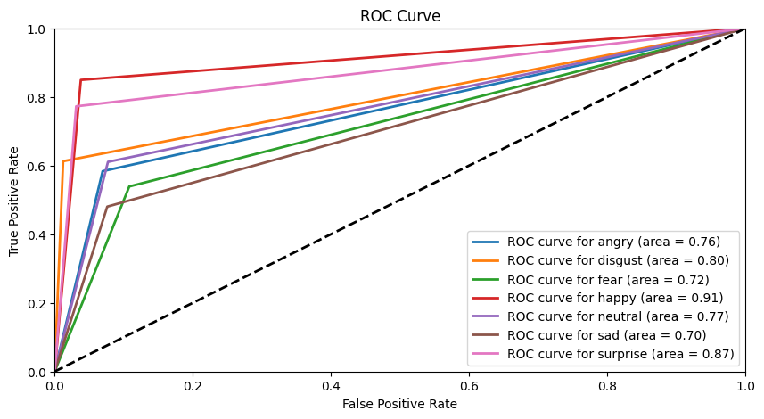

# Emotion-Detection-Using-CNN-And-FER-2013-Dataset

## Introduction
This project leverages deep learning to classify emotions from facial expressions using the FER-2013 dataset. It combines custom CNNs and advanced models like ResNet50v2 for accurate classification and deploys a user-friendly interface on Hugging Face Spaces for real-time emotion detection.

## Key Features

- **Data Balancing**Applied image augmentation techniques and calculated **dynamic class weights** to address **class imbalance** in the **FER-2013 dataset**, ensuring robust and reliable model training on a more balanced dataset.
- **Model Optimization**Designed and refined custom CNN models using TensorFlow and Keras, while incorporating advanced architectures like **VGG16** and **ResNet50v2** to improve accuracy and performance metrics.
-**Performance Highlights**Achieved **65% accuracy** and a **weighted-average F1-score** of 0.65 across 7 emotion categories with the ResNet50v2 model, showcasing strong results for minority classes, including F1-scores of 0.51 for Disgust and 0.77 for Surprise.
-- **Deployment** Deployed the model on **Hugging Face Spaces**, enabling users to upload images and receive emotion predictions with confidence scores for each category.
  - **[Hugging face Spaces APP link](https://huggingface.co/spaces/nitish-11/emotion-is-detected-here)**

## SELECTED MODEL EVALUATION
- We choose the ResNet50v2 because of this performnce:
 - **Train accuracy** = 70.51 
 - **Validation accuracy** = 65.20
 - It has been trained for around **130 epochs** over mutliple changes in various parameters
 - Various parameters include dyanmic weights feature, changing of the iniital learning rate of optimizer, introduction of Exponential Decay Learning Rate Scheduler and many more

- Below are evaluation metrics used to test the Model Effiicency

**Classification Report**

**Confusion Matrix**

**AUC-ROC Plot for each Class**
 

